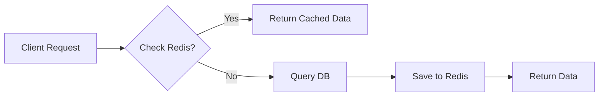

# Tài liệu kỹ thuật: Module Quản lý Nhân viên

## 1. Tổng quan
Tài liệu này phác thảo thiết kế kỹ thuật cho module **Quản lý Nhân viên**, dựa trên BRD đã chốt.
- **Mục tiêu**: Quản lý người dùng nội bộ (Nhân viên).
- **Đối tượng**: Admin (Toàn quyền).

## 2. Thiết kế Database (Prisma)

Sử dụng model `User` hiện có trong `schema.prisma`, tập trung vào `UserType.EMPLOYEE`.

### 2.1 Phân tích Schema
Ánh xạ bảng `User` hiện tại với yêu cầu BRD:

| Trường BRD | Trường Prisma | Kiểu | Ghi chú |
| :--- | :--- | :--- | :--- |
| **ID** | `id` | `Int` | Khóa chính, Tự tăng |
| **Tên đăng nhập** | `username` | `String` | Duy nhất (Nên đánh Partial Index cho `isActive=true` nếu dùng soft delete) |
| **Mật khẩu** | `password` | `String` | Đã mã hóa (bcrypt) |
| **Họ và tên** | `fullName` | `String` | |
| **Email** | `email` | `String?` | Không bắt buộc |
| **Số điện thoại** | `phone` | `String?` | Không bắt buộc |
| **Quyền hạn** | `role` | `String` | Giá trị Enum lưu dưới dạng String |
| **Trạng thái** | `isActive` | `Boolean` | True (Hoạt động) / False (Vô hiệu hóa) |
| **Loại TK** | `type` | `UserType`| Luôn là `EMPLOYEE` |
| **Ngày tạo** | `createdAt` | `DateTime` | |
| **Ngày xóa** | `deletedAt` | `DateTime?`| Xóa mềm (Soft Delete) |

### 2.2 Quyền hạn (Roles)
Định nghĩa trong constants (ví dụ: `src/constants/roles.js`):
```javascript
export const ROLES = {
  ADMIN: 'ADMIN',
  SALE: 'SALE',
  KHO_TQ: 'KHO_TQ',
  KE_TOAN: 'KE_TOAN',
  DIEU_VAN: 'DIEU_VAN',
  KHO_VN: 'KHO_VN',
  CHUNG_TU: 'CHUNG_TU'
};
```

### 2.3 Chiến lược Index DB
Để tối ưu hiệu năng truy vấn, cần tạo các index sau trong DB (PostgreSQL):
- **Index `username`**: Unique Index (Đã có mặc định).
- **Index `role`**: B-Tree Index. Giúp lọc nhanh danh sách theo quyền hạn.
- **Index `isActive`**: B-Tree Index. Giúp lọc nhanh danh sách nhân viên đang hoạt động.
- **Lưu ý**: Với số lượng nhân viên nhỏ (<1000), việc đánh index phức tạp là không cần thiết. PostgreSQL xử lý cực nhanh ở quy mô này. Chỉ cần đảm bảo các trường lọc chính (`role`, `status`) có index cơ bản.

## 3. Đặc tả API (API Specification)

Base URL: `/api/employees`

### 3.1 Danh sách nhân viên
- **Endpoint**: `GET /`
- **Quyền**: `ADMIN`
- **Query Params**:
  - `page`: Số (Mặc định 1)
  - `limit`: Số (Mặc định 20)
  - `search`: Chuỗi (Tìm theo username, fullName, email, phone)
  - `status`: 'active' | 'inactive' | 'all' (Lọc theo trạng thái)
  - `role`: Chuỗi (Lọc theo quyền cụ thể)
- **Response**:
  ```json
  {
    "data": [
      { "id": 1, "username": "admin", "fullName": "Admin", "role": "ADMIN", "isActive": true, ... }
    ],
    "pagination": { "total": 100, "page": 1, "limit": 20 }
  }
  ```

### 3.2 Tạo mới nhân viên
- **Endpoint**: `POST /`
- **Quyền**: `ADMIN`
- **Body**:
  ```json
  {
    "username": "user1",
    "password": "password123",
    "fullName": "Nguyen Van A",
    "email": "a@test.com",
    "phone": "0123456789",
    "role": "SALE",
    "isActive": true
  }
  ```
- **Validation**:
  - `username`: Bắt buộc, Duy nhất.
  - `password`: Bắt buộc, độ dài tối thiểu 6.
  - `role`: Phải thuộc danh sách ROLES đã định nghĩa.

### 3.3 Chi tiết nhân viên
- **Endpoint**: `GET /:id`
- **Quyền**: `ADMIN`
- **Response**: Object User (Kiểm tra `deletedAt` phải là null).

### 3.4 Cập nhật nhân viên
- **Endpoint**: `PUT /:id`
- **Quyền**: `ADMIN`
- **Body**: (Cập nhật một phần)
  ```json
  {
    "fullName": "Nguyen Van B",
    "role": "KHO_TQ",
    "isActive": false,
    "email": "..."
  }
  ```
- **Logic**:
  - **Không được** sửa `username`.
  - **Không được** sửa `password` ở API này (Bỏ qua nếu gửi lên).

### 3.5 Reset mật khẩu
- **Endpoint**: `POST /:id/reset-password`
- **Quyền**: `ADMIN`
- **Body**: Rỗng.
- **Logic**:
  - Đặt lại `password` thành hash của "123".
  - Trả về thông báo thành công.

### 3.6 Xóa nhân viên
- **Endpoint**: `DELETE /:id`
- **Quyền**: `ADMIN`
- **Logic**:
  - Xóa mềm: Set `deletedAt = NOW()`.
  - Kiểm tra tự xóa: `req.user.id !== params.id` (Không cho phép tự xóa chính mình).

## 4. Logic Frontend (Tham khảo)

- **Quản lý State**: React Query hoặc `useEffect` + `useState`.
- **Xử lý Form**: React Hook Form + Zod/Yup validation.
- **UI Components**: Ant Design Table, Modal, Form.

## 5. Bảo mật & Middleware
- `authMiddleware`: Xác thực JWT.
- `roleMiddleware(['ADMIN'])`: Kiểm soát quyền truy cập.

## 6. Chiến lược Caching (Redis)

Vì danh sách nhân viên ít thay đổi nhưng được truy vấn thường xuyên (ví dụ: để hiển thị người phụ trách trong các dropdown), áp dụng caching như sau:

### 6.1 Cache Keys
- `employees:list:${page}:${limit}:${status}:${role}:${search}`: Lưu kết quả API danh sách.
- `employees:detail:${id}`: Lưu chi tiết nhân viên.

*Ghi chú: Với số lượng nhân viên < 1000, việc query trực tiếp DB cũng rất nhanh. Redis ở đây chủ yếu để giảm tải cho DB nếu hệ thống có nhiều truy cập đồng thời hoặc dùng chung cơ chế với các module lớn khác.*

### 6.2 TTL (Time-to-Live)
- **Danh sách & Chi tiết**: 600 giây (10 phút). Dữ liệu này ít biến động.

### 6.3 Invalidation Strategy (Xóa Cache)
Khi có hành động **Tạo mới / Cập nhật / Xóa / Reset Password**, thực hiện:
1. Xóa toàn bộ keys pattern `employees:list:*`.
2. Nếu là Cập nhật/Xóa/Reset: Xóa key `employees:detail:${id}` tương ứng.


